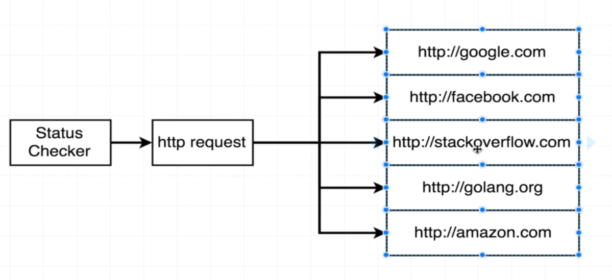
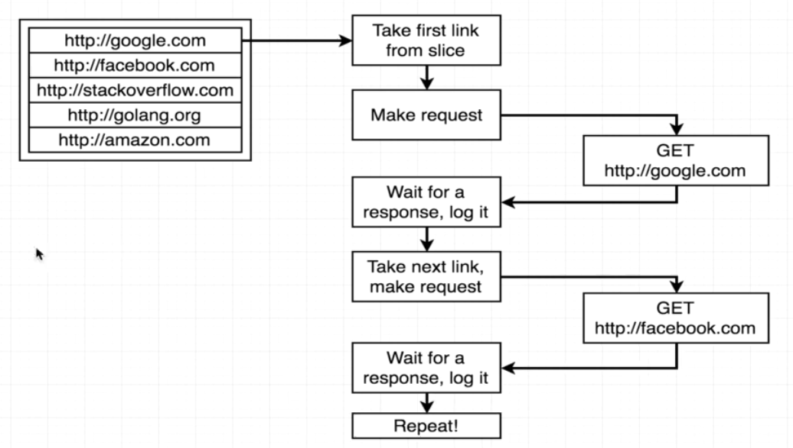
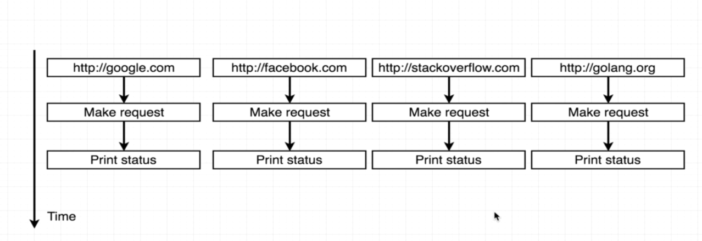

# Channels

Run by running

```
make run
```

and

```
# go run 06_channels/main.go
```

or simply

```
# docker exec -it learning_go go run 06_channels/main.go
```

We want to build a program that check the status of a set of websites.



In a for loop we will just be waiting for each request to finish before starting another one.



Instead, we can use go routines to make each request in parallel.


