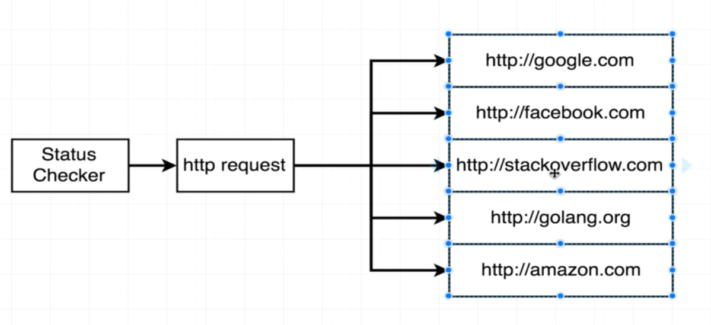
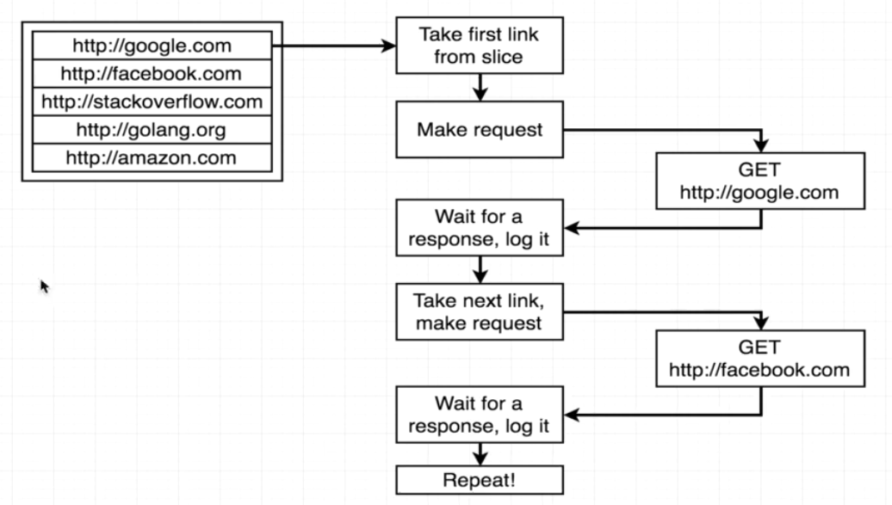
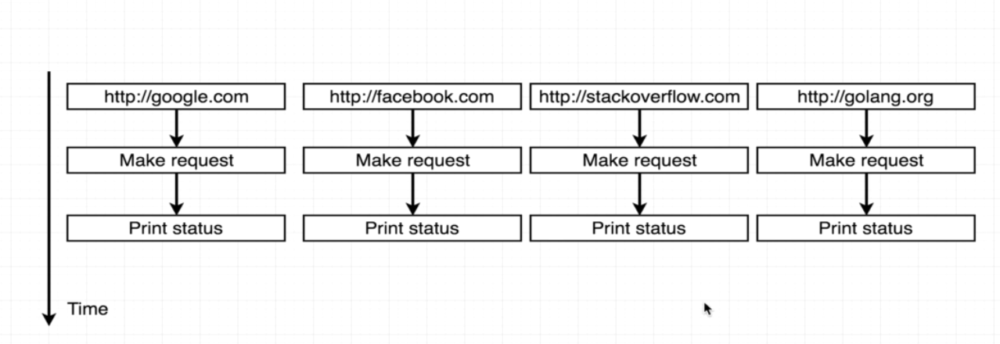
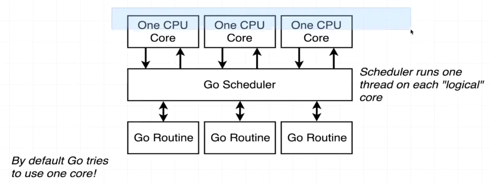
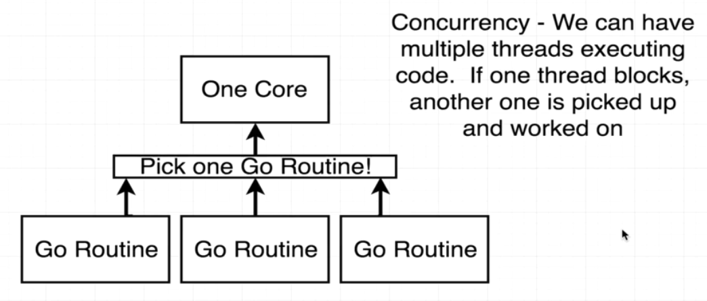
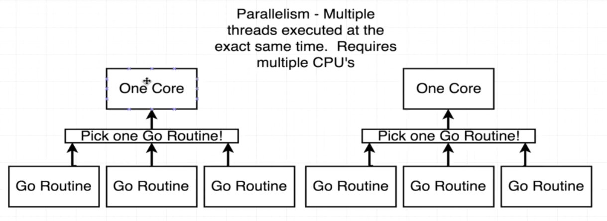
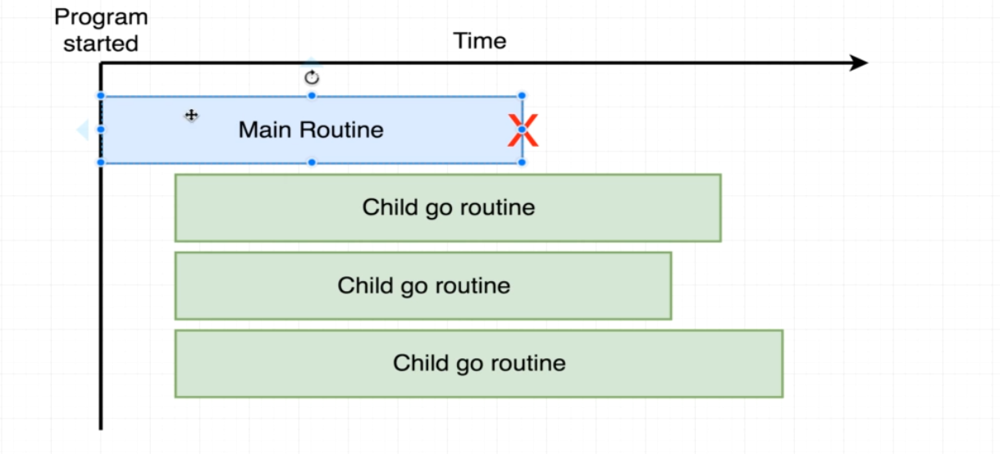
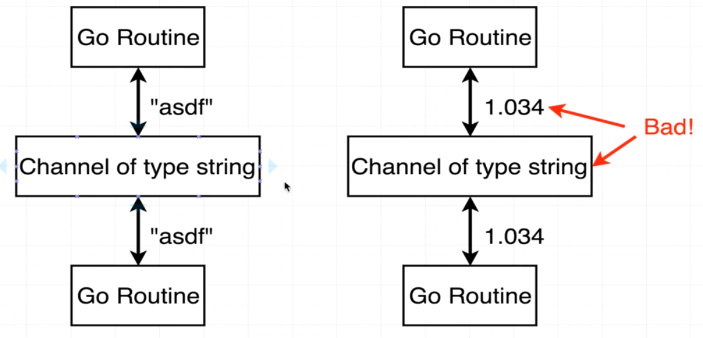
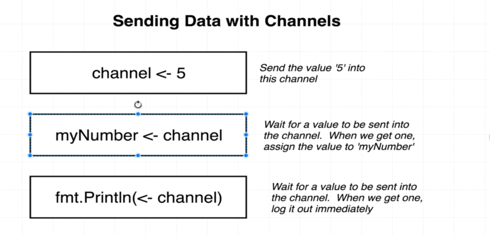
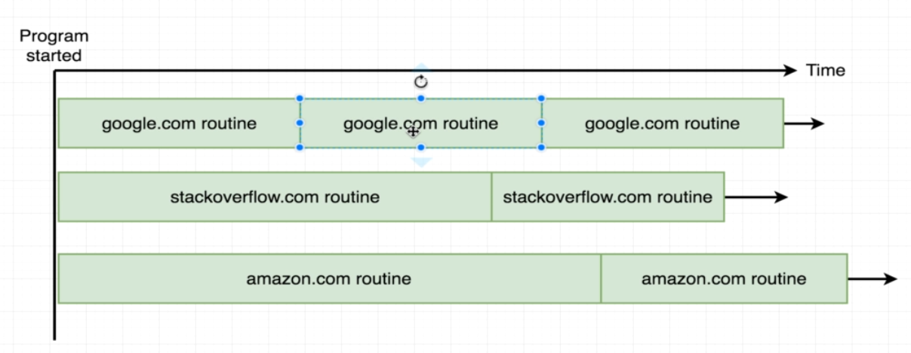

# Channels

Run by running

```
make run
```

and

```
# go run 06_channels/main.go
```

or simply

```
# docker exec -it learning_go go run 06_channels/main.go
```

We want to build a program that check the status of a set of websites.



In a for loop we will just be waiting for each request to finish before starting another one.



Instead, we can use go routines to make each request in parallel.



## Concurrency is not parallelism



**Concurrency**: run multiple go routines at the same time.



**Parallelism**: requires multiple CPUs.



When the main routine finishes before the child routines, the program quits automatically.



To avoid this we will use channels, to communicate between go routines. They need to be typed specifying the type of information that needs to be sent through them.



There are several ways to communicate with a channel explained below.



A third approach will be done to continuously request the status of the urls.


